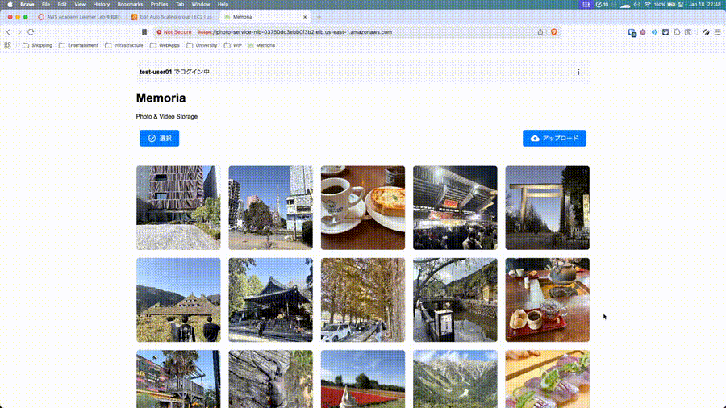
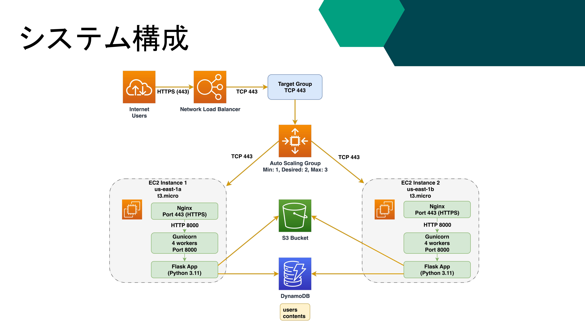

# photo-service

AWS 向けのクラウドフォトサービスです。Network Load Balancer・Auto Scaling・S3・DynamoDB などを AWS 上に用意したうえで、EC2 のユーザデータでアプリケーションを起動する構成を想定しています。

## システム構成

以下の図は本システムのAWS周りの構成図です。

下表は構成要素の役割と、想定しているリソース名の例です（実際の名前は環境に合わせてください）。

| タイプ                   | 役割・機能          | リソース名                              |
| --------------------- | -------------- | ---------------------------------- |
| Network Load Balancer | ロードバランシング(NLB) | photo-service-nlb                  |
| Target Group          | NLBのターゲット      | photo-service-tg-tcp443            |
| Auto Scaling Group    | オートスケールの設定     | photo-service-asg                  |
| Launch Template       | EC2の起動テンプレート   | photo-service-launch-template-v2   |
| Security Group (NLB)  | NLB用の通信ルール     | photo-service-nlb-sg               |
| Security Group (EC2)  | EC2用の通信ルール     | photo-service-ec2-sg               |
| S3 Bucket             | ストレージ          | photo-video-storage-5381-1252-7281 |
| DynamoDB Table        | データベース         | users                              |
| DynamoDB Table        | データベース         | contents                           |
| DynamoDB GSI          | DBの補助インデックス    | user-contents-index                |
| VPC                   | サブネット          | Default VPC                        |
| Lifecycle rules       | S3用ライフサイクルルール  | move-to-standard-ia-after-30-days  |

## 利用方法

[userdata.sh](userdata.sh) にはリポジトリ用のダミーが入っています（例: `your-nlb-dns.elb.us-east-1.amazonaws.com`、`your-s3-bucket-name`、`git clone` の `YOUR_ACCOUNT`）。そのままでは `git clone` が失敗したり、S3 などが正しく動きません。次の手順3と「userdata.sh で環境に合わせて書き換える箇所」の表どおり、実環境の値に差し替えるか、ユーザデータの先頭で `export NLB_DOMAIN=...` などを指定してください。

1. AWS 側で、上表に相当するリソース（NLB、ターゲットグループ、ASG、Launch Template、セキュリティグループ、S3、DynamoDB、VPC など）を用意する
2. Launch Template または EC2 作成時のユーザデータに、[userdata.sh](userdata.sh) の内容を貼り付ける（別途 S3 に置いて起動時に取得する運用でも可）
3. 上記のとおりダミーを置き換えるか、ユーザデータ先頭で必要な変数を `export` する（詳細は次節の表）

`.env` の `S3_BUCKET_NAME` と `AWS_REGION` はスクリプト内の変数から生成されます。`SECRET_KEY` は起動時に自動生成されるため、通常は手作業は不要です。

### userdata.sh で環境に合わせて書き換える箇所

| 対象                   | ファイル内の位置                                                                          | どう直すか                                                                                                                                                 |
| -------------------- | --------------------------------------------------------------------------------- | ----------------------------------------------------------------------------------------------------------------------------------------------------- |
| NLB の DNS 名          | 先頭付近の `NLB_DOMAIN="${NLB_DOMAIN:-...}"` のデフォルト値                                   | 自環境の NLB DNS（例: `xxx.elb.<region>.amazonaws.com`）に変更する。Launch Template などでユーザデータの先頭に `export NLB_DOMAIN=...` を追加し、デフォルトを使わない方法でもよい（スクリプト内コメントと同じ考え方）。 |
| S3 バケット名             | `S3_BUCKET_NAME="${S3_BUCKET_NAME:-...}"` のデフォルト値                                 | 利用するバケット名（上表の例と一致）に変更する。                                                                                                                              |
| リージョン                | `AWS_REGION="${AWS_REGION:-...}"` のデフォルト値                                         | デプロイ先リージョンに変更する。                                                                                                                                      |
| OpenSSL の SAN（リージョン） | `openssl req` の `-addext "subjectAltName=..."` 内の `*.elb.${AWS_REGION}.amazonaws.com` | `AWS_REGION` の値に連動する。デプロイ先リージョンに合わせて `AWS_REGION` のデフォルトまたは `export` を設定する。                                                            |
| リポジトリ URL            | `git clone https://github.com/YOUR_ACCOUNT/photo-service.git`                        | `YOUR_ACCOUNT` を自組織・自ユーザー名など実際の GitHub に合わせて差し替える。                                                                                                                          |

### 動作イメージの詳細

YouTubeにて動作している際の動画を上げていますので、ご参照ください。

[動作デモ(YouTube)](https://youtu.be/x0sC24OMe8I)
